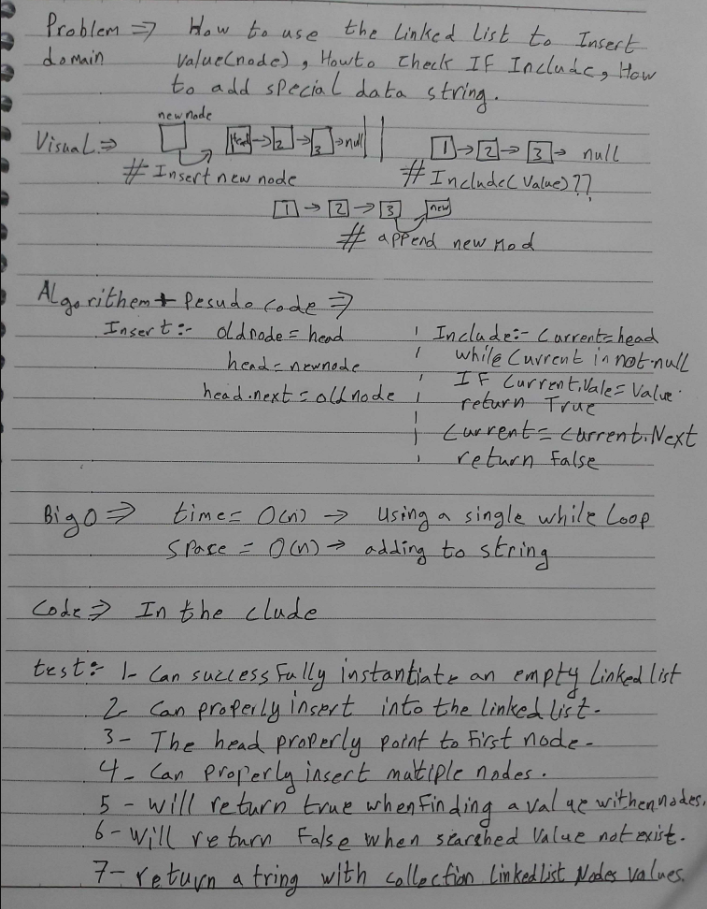
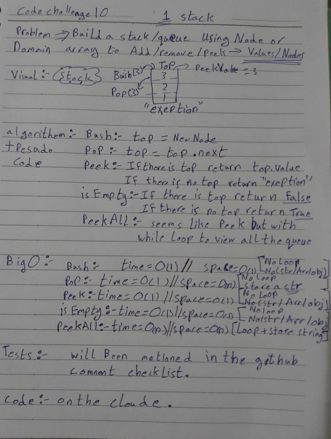
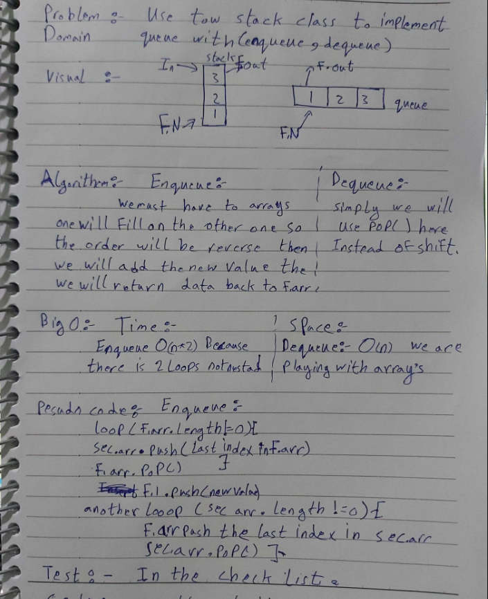
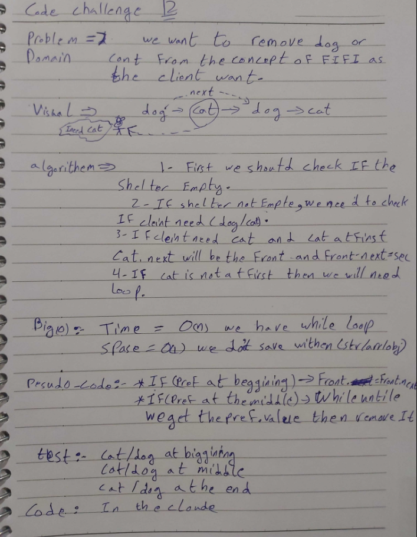

### 401 Data Structures, Code Challenges

- Please follow the instructions specific to your 401 language, which can be found in the directory below, matching your course.

# Singly Linked List
Implementation: Singly Linked Lists

## Challenge
* Create a Node class that has properties for the value stored in the Node, and a pointer to the next Node.
* Within your LinkedList class, include a head property. Upon instantiation, an empty Linked List should be created.
  * Define a method called insert which takes any value as an argument and adds a new node with that value to the head of the list with an O(1) Time performance.
  * Define a method called includes which takes any value as an argument and returns a boolean result depending on whether that value exists as a Node’s value somewhere within the list.
  * Define a method called toString (or __str__ in Python) which takes in no arguments and returns a string representing all the values in the Linked List, formatted as:
  "{ a } -> { b } -> { c } -> NULL"
* Any exceptions or errors that come from your code should be semantic, capturable errors. For example, rather than a default error thrown by your language, your code * * should raise/throw a custom, semantic error that describes what went wrong in calling the methods you wrote for this lab.
* Be sure to follow your language/frameworks standard naming conventions (e.g. C# uses PascalCasing for all method and class names).

## Approach & Efficiency

* insert method => Big O = 1
* incloudes => Big O = n
* toString method => Big O = n 

# Class-06 Linked List:

## Challenges

* `.append(value)` which adds a new node with the given value to the end of the list
* `.insertBefore(value, newVal)` which add a new node with the given newValue immediately before the first value node
* `.insertAfter(value, newVal)` which add a new node with the given newValue immediately after the first value node

## Approach & Efficiency

* append method => Big O = n.
* insertBefore => Big O = n.
* insertAfter method => Big O = n.

# Class-07 Linked List:

## Challenges

* `.kthFromEnd(k)` Write a method for the Linked List class which takes a number, k, as a parameter. Return the node’s value that is k from the end of the linked list. You have access to the Node class and all the properties on the Linked List class as well as the methods created in previous challenges.

## Approach & Efficiency

* kthFromEnd method => Big O = n.

# Class-08 Linked List:

## Challenges

* Write a function called `zipLists` which takes two linked lists as arguments. Zip the two linked lists together into one so that the nodes alternate between the two lists and return a reference to the head of the zipped list. Try and keep additional space down to O(1). You have access to the Node class and all the properties on the Linked List class as well as the methods created in previous challenges.

## Approach & Efficiency

* zipLists method => Big O = n.

# Class-10 Queue and Stack:

## Challenges

* Create a Node class that has properties for the value stored in the Node, and a pointer to the next node.
* Create a Stack class that has a top property. It creates an empty Stack when instantiated.
  This object should be aware of a default empty value assigned to top when the stack is created.
    1. Define a method called push which takes any value as an argument and adds a new node with that value to the top of the stack with an O(1) Time performance.
    2. Define a method called pop that does not take any argument, removes the node from the top of the stack, and returns the node’s value.
    Should raise exception when called on empty stack
    3. Define a method called peek that does not take an argument and returns the value of the node located on top of the stack, without removing it from the stack.
    Should raise exception when called on empty stack
    4. Define a method called isEmpty that takes no argument, and returns a boolean indicating whether or not the stack is empty.
* Create a Queue class that has a front property. It creates an empty Queue when instantiated.
  This object should be aware of a default empty value assigned to front when the queue is created.
    1. Define a method called enqueue which takes any value as an argument and adds a new node with that value to the back of the queue with an O(1) Time performance.
    2. Define a method called dequeue that does not take any argument, removes the node from the front of the queue, and returns the node’s value.
    Should raise exception when called on empty queue
    3. Define a method called peek that does not take an argument and returns the value of the node located in the front of the queue, without removing it from the queue.
    Should raise exception when called on empty queue
    4. Define a method called isEmpty that takes no argument, and returns a boolean indicating whether or not the queue is empty.
    Be sure to follow your languages best practices for naming conventions.

## Approach & Efficiency

* push method => Big O = 1.
* pop method => Big O = 1.
* peek method => Big O = 1.
* isEmpty method => Big O = 1.

# Class-11 Queue With Stacks:

## Challenges

   Create a brand new PseudoQueue class. Do not use an existing Queue. Instead, this PseudoQueue class will implement our standard queue interface (the two methods listed below), but will internally only utilize 2 Stack objects. Ensure that you create your class with the following methods:

  * enqueue(value) which inserts value into the PseudoQueue, using a first-in, first-out approach.
  * dequeue() which extracts a value from the PseudoQueue, using a first-in, first-out approach.
  * The Stack instances have only push, pop, and peek methods. You should use your own Stack implementation. Instantiate these Stack objects in your PseudoQueue constructor.

## Approach & Efficiency

* enqueue method => Big O = 2n.
* dequeue method => Big O = 1.

# Class-12 Fifo animal shelter:

## Challenges
 Create a class called AnimalShelter which holds only dogs and cats. The shelter operates using a first-in, first-out approach.
 Implement the following methods:
* enqueue(animal): adds animal to the shelter. animal can be either a dog or a cat object.
* dequeue(pref): returns either a dog or a cat. If pref is not "dog" or "cat" then return null.

## Approach & Efficiency

* enqueue method => Big O = 1.
* dequeue method => Big O = n.

