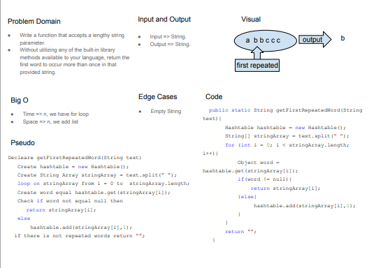

# Hashtables
Hash table (hash map) is a data structure that implements an associative array abstract data type, a structure that can map keys to values. A hash table uses a hash function to compute an index, also called a hash code, into an array of buckets or slots, from which the desired value can be found. During lookup, the key is hashed and the resulting hash indicates where the corresponding value is stored.

## Challenge
Implement a Hashtable with the following methods:
1- `add`: takes in both the key and value. This method should hash the key, and add the key and value pair to the table, handling collisions as needed.
2- `get`: takes in the key and returns the value from the table.
3- `contains`: takes in the key and returns a boolean, indicating if the key exists in the table already.
4- `hash`: takes in an arbitrary key and returns an index in the collection.

## Approach & Efficiency
#### Big O of `add`: O(n) Because we have hash method which has n time complexity.

#### Big O of `get`: O(2n) Because we have while loop and hash method which has n time complexity.

#### Big O of `contains`: O(2n) Because we have while loop and hash method which has n time complexity.

#### Big O of `hash`: O(n) Because we have while loop.

#### Space comp of `add`: O(n) Because we add Linkedlist.

#### Space comp of `get`: O(1).

#### Space comp `contains`: O(1).

#### Space comp `hash`: O(1).

## API
<!-- Description of each method publicly available in each of your hashtable -->
1- `add`: takes in both the key and value. This method should hash the key, and add the key and value pair to the table, handling collisions as needed.
2- `get`: takes in the key and returns the value from the table.
3- `contains`: takes in the key and returns a boolean, indicating if the key exists in the table already.
4- `hash`: takes in an arbitrary key and returns an index in the collection.


# Challenge 31 Summary
* Write a function that accepts a lengthy string parameter.
* Without utilizing any of the built-in library methods available to your language, return the first word to occur more than once in that provided string.

## Whiteboard Process

[Link](https://docs.google.com/drawings/d/1q_BQ10IiLeRI4ySWByW_nF8EiEQaKwMBbE_ZW0aQVCk/edit?usp=sharing)

## Approach & Efficiency
Big O => O(n), we just have for loop
Space comp => O(n), we added a hashmap

## Solution
```
public class RepeatedWord {
    public static String getFirstRepeatedWord(String text){
        Hashtable hashtable = new Hashtable();
        String[] stringArray = text.split(" ");
        for (int i = 0; i < stringArray.length; i++){
            Object word = hashtable.get(stringArray[i]);
            if(word != null){
                return stringArray[i];
            }else{
                 hashtable.add(stringArray[i],1);
            }
        }
        return "";
    }
```