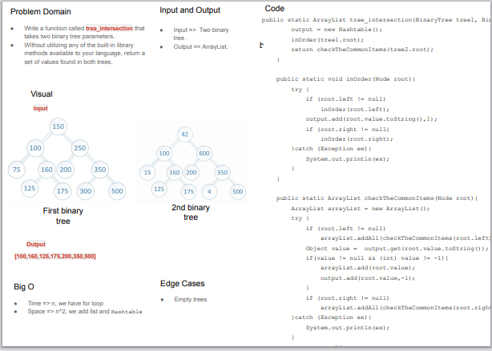

# Challenge Summary
* Write a function called tree_intersection that takes two binary tree parameters.
* Without utilizing any of the built-in library methods available to your language, return a set of values found in both trees.

## Whiteboard Process

[Link](https://docs.google.com/drawings/d/106Se_1LOpk1wJaVMWTq8E_KCyOPC7OYzoF3amgVdV7M/edit?usp=sharing)

## Approach & Efficiency
Big O => O(n), we just have Recreation loop.
Space comp => O(n^2), we added a hashmap and arraylist.

## considering that the original normal binary tree will always take N^2, what do you think optimal BST could be? 

The time complexity is one in binary search if we want to use only the BST it will be O(log(n)) I thing.
We can change the way of looping over the tree is we just have Binary tree, and that will make the time complexity O(log(n)) .

## Solution
```   
    //Solution With Hashtable
    static Hashtable output;

    public static ArrayList tree_intersection(BinaryTree tree1, BinaryTree tree2){
        output = new Hashtable();
        inOrder(tree1.root);
        return checkTheCommonItems(tree2.root);
    }

    public static void inOrder(Node root){
        try {
            if (root.left != null)
                inOrder(root.left);
            output.add(root.value.toString(),1);
            if (root.right != null)
                inOrder(root.right);
        }catch (Exception ex){
            System.out.println(ex);
        }
    }

    public static ArrayList checkTheCommonItems(Node root){
        ArrayList arrayList = new ArrayList();
        try {
            if (root.left != null)
                arrayList.addAll(checkTheCommonItems(root.left));
            Object value =  output.get(root.value.toString());
            if(value != null && (int) value != -1){
                arrayList.add(root.value);
                output.add(root.value,-1);
            }
            if (root.right != null)
                arrayList.addAll(checkTheCommonItems(root.right));
        }catch (Exception ex){
            System.out.println(ex);
        }
        return arrayList;
    }
```