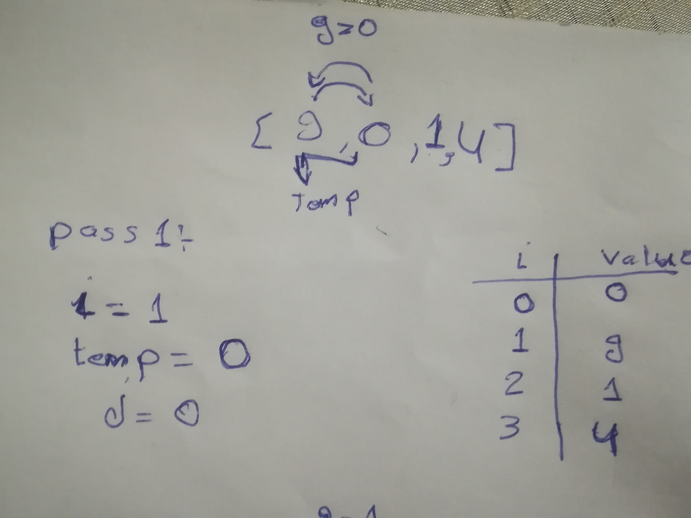
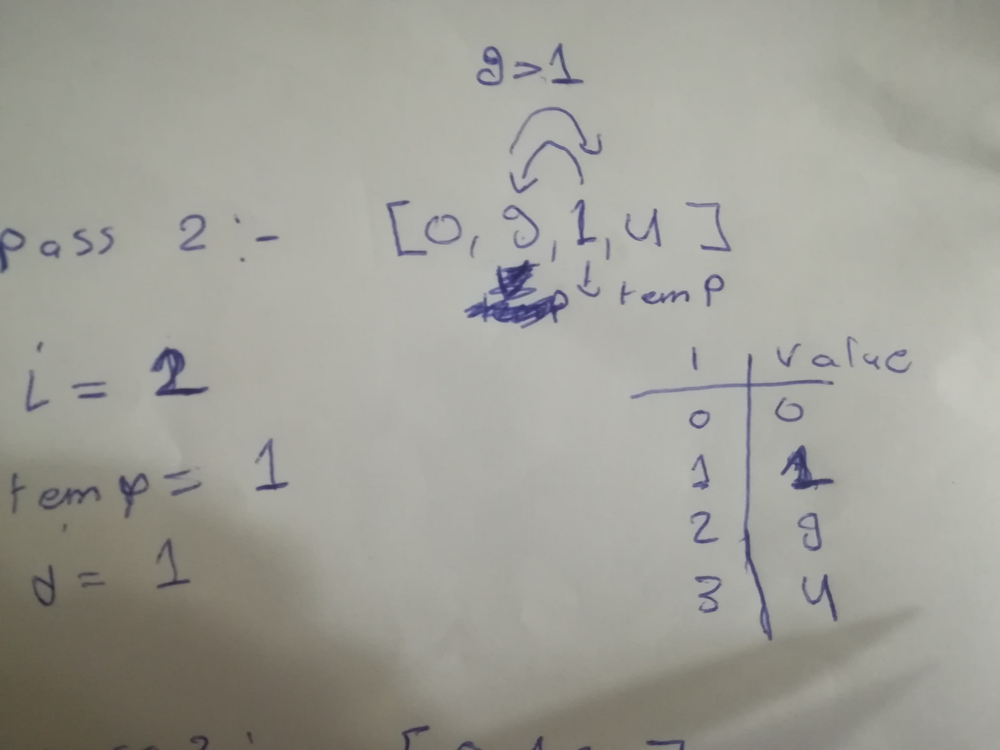
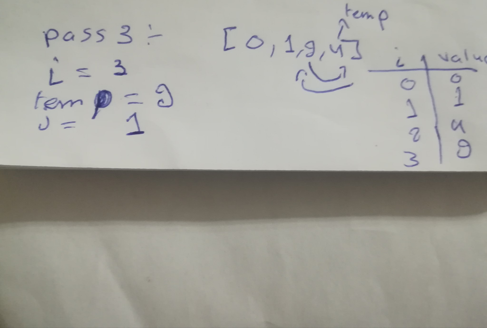

# Insertion Sort: 
Insertion sort is a simple sorting algorithm that works similar to the way you sort playing cards in your hands. The array is virtually split into a sorted and an unsorted part. Values from the unsorted part are picked and placed at the correct position in the sorted part.

### Pseudocode

```
  InsertionSort(int[] arr)
  
    FOR i = 1 to arr.length
    
      int j <-- i - 1
      int temp <-- arr[i]
      
      WHILE j >= 0 AND temp < arr[j]
        arr[j + 1] <-- arr[j]
        j <-- j - 1
        
      arr[j + 1] <-- temp
```

### Trace
Sample Array: `[9,0,1,4]`

##### Pass 1:



In first pass we check if the values before the item in index 1 if less than this item, then sweech the items.
Here the item in the first index is 9 and the item in the 0 index is 0 so we sweech between the values.


##### Pass 2:



In secound pass we check if the values before the item in index 2 if less than this item, then sweech the items.
Here the item in the secound index is 9 and the item in the secound index is 1 so we sweech between the values.


##### Pass 3:



In third pass we check if the values before the item in index 3 if less than this item, then sweech the items.
Here the item in the third index is 4 and the item in the third index is 4 so we sweech between the values.


### Efficency

Time: O(n^2)
The basic operation of this algorithm is comparison. This will happen n * (n-1) number of times…concluding the algorithm to be n squared.
Space: O(1)
No additional space is being created. This array is being sorted in place…keeping the space at constant O(1).

```
ArrayList array = new ArrayList();
array.add(9);
array.add(0);
array.add(1);
array.add(4);
InsertionSort.insertionSort(array);

public class InsertionSort {
    static public ArrayList<Object> insertionSort(ArrayList<Object> array){
        // Firt pass => array = [9,0,1,4]
        for (int i = 1 ; i < array.size() ; i++){
            // Firt pass => i = 1
            // Second pass => i = 2
            // Third pass => i = 3 

            int j = i - 1;
            // Firt pass => j = 0
            // Second pass => j = 1
            // Third pass => j = 2 

            Object temp = array.get(i);
            // Firt pass => temp = 9
            // Second pass => temp = 0
            // Third pass => temp = 1 

            while (j >= 0 && (int) temp < (int) array.get(j)){
                // Firt pass => j = 0, temp = 0, arr = (4) [0, 9, 1, 4]
                // Second pass => j = 1, temp = 1, arr = (4) [0, 9, 1, 4]
                // Third pass => j = 2, temp = 4, arr = (4) [0, 1, 9, 4]

                array.set((j + 1),array.get(j));
                // Second pass => temp = 1
                // Third pass => temp = 4

                array.set(j, temp);
                j = j - 1;
            }}
        return array;
    }
}

```
