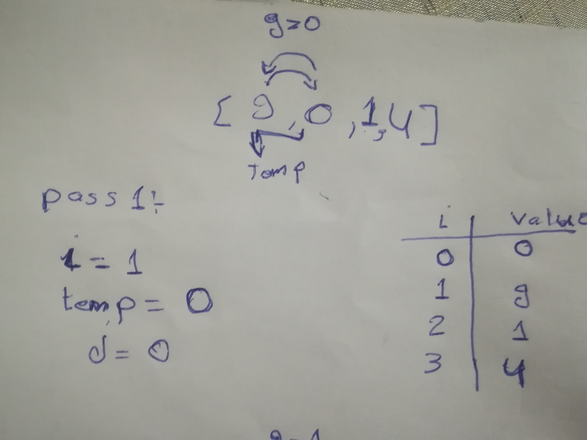
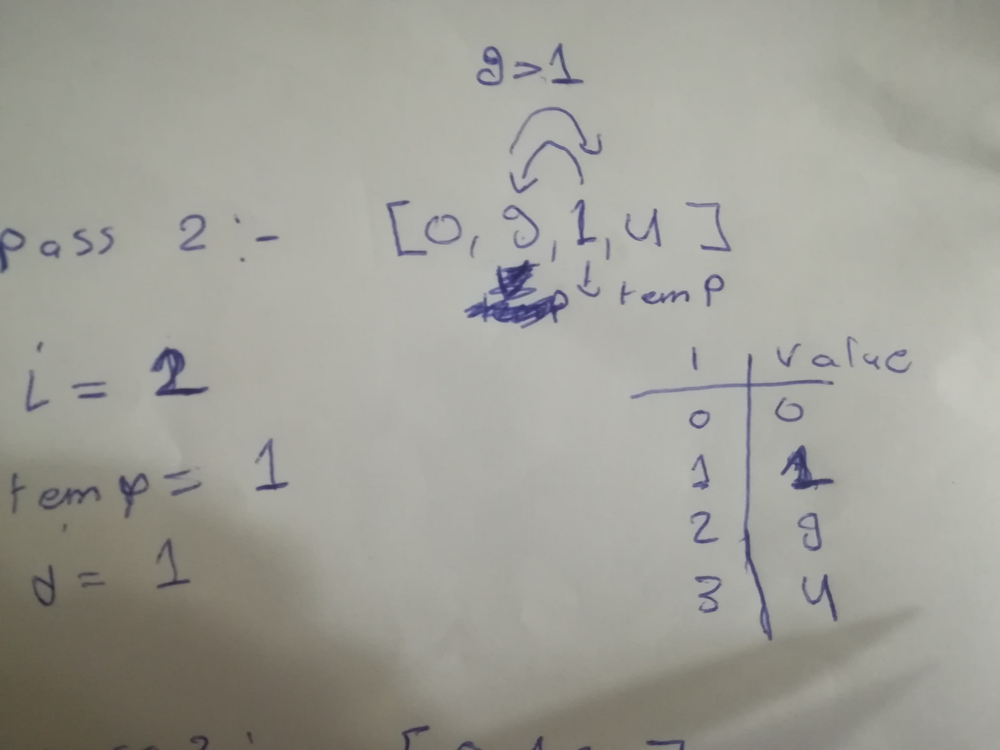
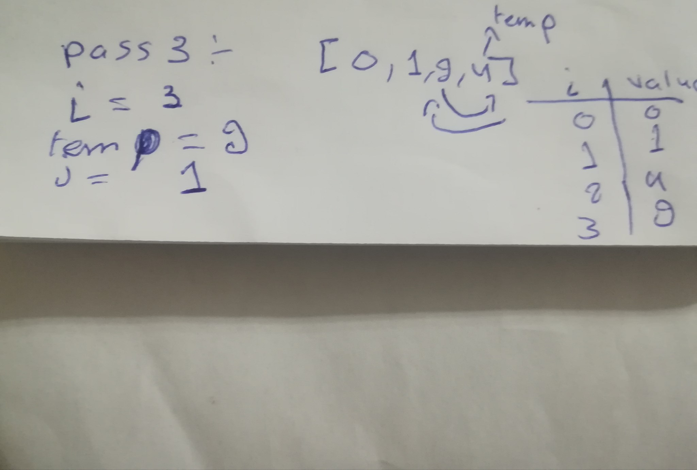

# Merge Sort: 
Merge Sort is a Divide and Conquer algorithm. It divides the input array into two halves, calls itself for the two halves, and then merges the two sorted halves. The merge() function is used for merging two halves. The merge(arr, l, m, r) is a key process that assumes that arr[l..m] and arr[m+1..r] are sorted and merges the two sorted sub-arrays into one. See the following C implementation for details.

### Pseudocode

```
ALGORITHM Mergesort(arr)
    DECLARE n <-- arr.length
           
    if n > 1
      DECLARE mid <-- n/2
      DECLARE left <-- arr[0...mid]
      DECLARE right <-- arr[mid...n]
      // sort the left side
      Mergesort(left)
      // sort the right side
      Mergesort(right)
      // merge the sorted left and right sides together
      Merge(left, right, arr)

ALGORITHM Merge(left, right, arr)
    DECLARE i <-- 0
    DECLARE j <-- 0
    DECLARE k <-- 0

    while i < left.length && j < right.length
        if left[i] <= right[j]
            arr[k] <-- left[i]
            i <-- i + 1
        else
            arr[k] <-- right[j]
            j <-- j + 1
            
        k <-- k + 1

    if i = left.length
       set remaining entries in arr to remaining values in right
    else
       set remaining entries in arr to remaining values in left
```

### Trace
Sample Array: `[100, 20, 3]`

##### Pass 1:



In first pass we check if the values before the item in index 1 if less than this item, then sweech the items.
Here the item in the first index is 9 and the item in the 0 index is 0 so we sweech between the values.


##### Pass 2:



In secound pass we check if the values before the item in index 2 if less than this item, then sweech the items.
Here the item in the secound index is 9 and the item in the secound index is 1 so we sweech between the values.


##### Pass 3:



In third pass we check if the values before the item in index 3 if less than this item, then sweech the items.
Here the item in the third index is 4 and the item in the third index is 4 so we sweech between the values.

```
 Mergesort([100, 20, 3]);
 ArrayList array = new ArrayList();
 array.add(100);
 array.add(20);
 array.add(3);
 System.out.println(MergeSort.Mergesort(array));


 public class MergeSort {
    public static ArrayList<Object> Mergesort(ArrayList<Object> array){

        // Firt pass => n=3 
        // Second pass => n=1
        // Third pass => n=2 
        // fourth pass => n=1       
        // Fifth pass  => n=1
        int n = array.size();

        if(n > 1){
            // Firt pass => mid=1  
            // Second pass => mid=1
            // Third pass => mid=1   
            // fourth pass => mid=1    
            // Fifth pass => mid=1  
            int mid = (int) Math.floor(n / 2);
            
            // Firt pass => left= [100] 
            // Second pass => left= [100]
            // Third pass => left= [20]    
            // fourth pass => left= [20]  
            // Fifth pass  => left= [20]  
            ArrayList left = new ArrayList(array.subList(0 , mid));


            // Firt pass => right= [20, 3] 
            // Second pass => right= [20, 3]
            // Third pass => right= [3]
            // fourth pass => right= [3]   
            // Fifth pass  => right= [3] 
            ArrayList right = new ArrayList(array.subList(mid, array.size()));

            Mergesort(left);

            // sort the right side
            Mergesort(right);

            // merge the sorted left and right sides together
            Merge(left, right, array);
        }
        return array;
    }

    //////////////Start From pass Five /////////////
    public static void Merge(ArrayList left,ArrayList right,ArrayList arr){


        // Fifth pass  => i = 0
        // Fifth pass  => j = 0
        // Fifth pass  => k = 0
        int i = 0;
        int j = 0;
        int k = 0;

        while( i < left.size() && j < right.size()){
            // Fifth pass  => i = 0
            // Fifth pass  => j = 0 
            // Fifth pass  => k = 0
            if((int) left.get(i) <= (int) right.get(j)){
                arr.set(k,left.get(i));
                i = i + 1;
            }
            else{
                // Fifth pass  => arr[0] = 3    
                arr.set(k,right.get(j));

                // Fifth pass  => j = 1     
                j = j + 1;
            }

            // Fifth pass  => k = 1   
            k = k + 1;
        }
        if(i == left.size()){
            for(int l = j ; l < right.size() ; l++){
                arr.set(k,right.get(l));
                k++;
            }
        }
        else
        {
            for(int l = i ; l < left.size() ; l++){
                arr.set(k,left.get(l));
                k++;
            }
        }
    }
}  
```

### Efficency

Time: O(n^2)
The basic operation of this algorithm is comparison. This will happen n * (n-1) number of times…concluding the algorithm to be n squared.
Space: O(1)
No additional space is being created. This array is being sorted in place…keeping the space at constant O(1).
