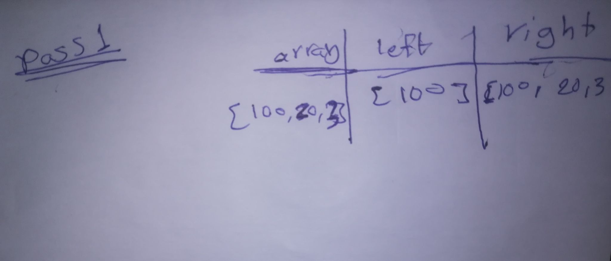
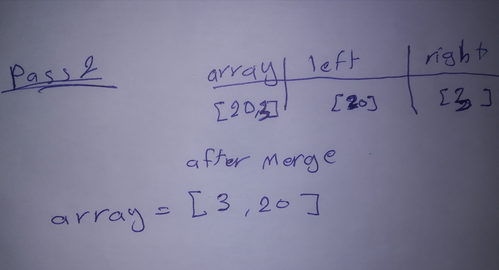
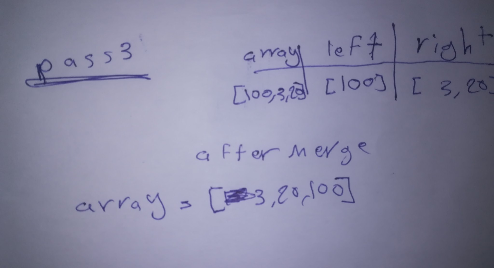

# Merge Sort: 
Merge Sort is a Divide and Conquer algorithm. It divides the input array into two halves, calls itself for the two halves, and then merges the two sorted halves. The merge() function is used for merging two halves. The merge(arr, l, m, r) is a key process that assumes that arr[l..m] and arr[m+1..r] are sorted and merges the two sorted sub-arrays into one. See the following C implementation for details.


### Pseudocode
```
ALGORITHM Mergesort(arr)
    DECLARE n <-- arr.length
           
    if n > 1
      DECLARE mid <-- n/2
      DECLARE left <-- arr[0...mid]
      DECLARE right <-- arr[mid...n]
      // sort the left side
      Mergesort(left)
      // sort the right side
      Mergesort(right)
      // merge the sorted left and right sides together
      Merge(left, right, arr)

ALGORITHM Merge(left, right, arr)
    DECLARE i <-- 0
    DECLARE j <-- 0
    DECLARE k <-- 0

    while i < left.length && j < right.length
        if left[i] <= right[j]
            arr[k] <-- left[i]
            i <-- i + 1
        else
            arr[k] <-- right[j]
            j <-- j + 1
            
        k <-- k + 1

    if i = left.length
       set remaining entries in arr to remaining values in right
    else
       set remaining entries in arr to remaining values in left
```

### Trace
Sample Array: `[100, 20, 3]`

##### Pass 1:



In first pass left part of the array is `[100]` and the right `[30, 3]` and the array that we use array `[100, 20, 3]`.


##### Pass 2:



In 2nd pass left part of the array is `[20]` and the right `[3]` and the array that we use array `[20, 3]`, here we call `Merge` Method,
the `Marge` will sort the array to be `[3, 20]`   


##### Pass 3:



In theard pass left part of the array is `[100]` and the right `[3,20]` and the array that we use array `[100, 3, 20]`, here we call `Merge` Method, the `Marge` will sort the array to be `[3, 20, 100]`   


```
 Mergesort([100, 20, 3]);
 ArrayList array = new ArrayList();
 array.add(100);
 array.add(20);
 array.add(3);

 System.out.println(MergeSort.Mergesort(array));


 public class MergeSort {
    public static ArrayList<Object> Mergesort(ArrayList<Object> array){

        // Firt pass => n=3 
        // Second pass => n=1
        // Third pass => n=2 
        // fourth pass => n=1       
        // Fifth pass  => n=1
        int n = array.size();

        if(n > 1){
            // Firt pass => mid=1  
            // Second pass => mid=1
            // Third pass => mid=1   
            // fourth pass => mid=1    
            // Fifth pass => mid=1  
            int mid = (int) Math.floor(n / 2);
            
            // Firt pass => left= [100] 
            // Second pass => left= [100]
            // Third pass => left= [20]    
            // fourth pass => left= [20]  
            // Fifth pass  => left= [20]  
            ArrayList left = new ArrayList(array.subList(0 , mid));


            // Firt pass => right= [20, 3] 
            // Second pass => right= [20, 3]
            // Third pass => right= [3]
            // fourth pass => right= [3]   
            // Fifth pass  => right= [3] 
            ArrayList right = new ArrayList(array.subList(mid, array.size()));

            Mergesort(left);

            // sort the right side
            Mergesort(right);

            // merge the sorted left and right sides together
            Merge(left, right, array);
        }
        return array;
    }

    //////////////Start From pass Five /////////////
    public static void Merge(ArrayList left,ArrayList right,ArrayList arr){


        // Fifth pass  => i = 0
        // Fifth pass  => j = 0
        // Fifth pass  => k = 0
        int i = 0;
        int j = 0;
        int k = 0;

        while( i < left.size() && j < right.size()){
            // Fifth pass  => i = 0
            // Fifth pass  => j = 0 
            // Fifth pass  => k = 0
            if((int) left.get(i) <= (int) right.get(j)){
                arr.set(k,left.get(i));
                i = i + 1;
            }
            else{
                // Fifth pass  => arr[0] = 3    
                arr.set(k,right.get(j));

                // Fifth pass  => j = 1     
                j = j + 1;
            }

            // Fifth pass  => k = 1   
            k = k + 1;
        }
        if(i == left.size()){
            for(int l = j ; l < right.size() ; l++){
                arr.set(k,right.get(l));
                k++;
            }
        }
        else
        {
            for(int l = i ; l < left.size() ; l++){
                arr.set(k,left.get(l));
                k++;
            }
        }
    }
}  
```

### Efficency

The Big O for merge sort is O(n*log n).

As we have already learned in Binary Search that whenever we divide a number into half in every step, it can be represented using a logarithmic function, which is log n and the number of steps can be represented by log n + 1(at most)

Also, we perform a single step operation to find out the middle of any subarray, i.e. O(1).

And to merge the subarrays, made by dividing the original array of n elements, a running time of O(n) will be required.

Hence the total time for mergeSort function will become n(log n + 1), which gives us a time complexity of O(n*log n).

Worst Case Time Complexity [ Big-O ]: O(n*log n)

Best Case Time Complexity [Big-omega]: O(n*log n)

Average Time Complexity [Big-theta]: O(n*log n)

Space Complexity: O(n)

Time complexity of Merge Sort is O(n*Log n) in all the 3 cases (worst, average and best) as merge sort always divides the array in two halves and takes linear time to merge two halves.
It requires equal amount of additional space as the unsorted array. Hence its not at all recommended for searching large unsorted arrays.
