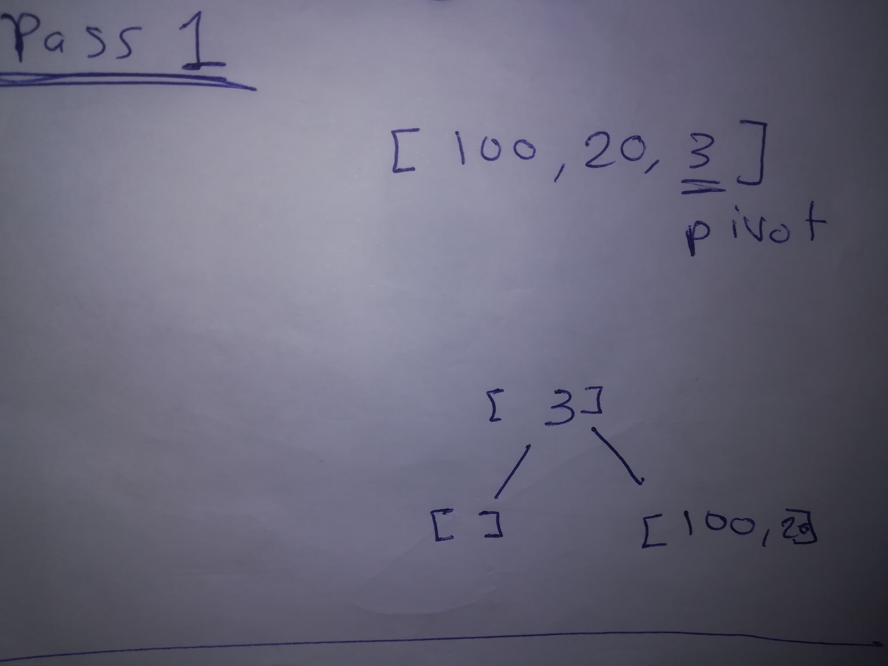
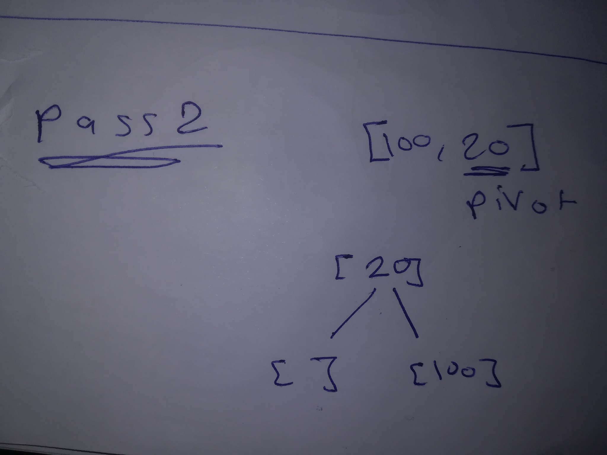

# Quick Sort: 
QuickSort is a Divide and Conquer algorithm. It picks an element as pivot and partitions the given array around the picked pivot. There are many different versions of quickSort that pick pivot in different ways. 


### Pseudocode
```
ALGORITHM QuickSort(arr, left, right)
    if left < right
        // Partition the array by setting the position of the pivot value 
        DEFINE position <-- Partition(arr, left, right)
        // Sort the left
        QuickSort(arr, left, position - 1)
        // Sort the right
        QuickSort(arr, position + 1, right)

ALGORITHM Partition(arr, left, right)
    // set a pivot value as a point of reference
    DEFINE pivot <-- arr[right]
    // create a variable to track the largest index of numbers lower than the defined pivot
    DEFINE low <-- left - 1
    for i <- left to right do
        if arr[i] <= pivot
            low++
            Swap(arr, i, low)

     // place the value of the pivot location in the middle.
     // all numbers smaller than the pivot are on the left, larger on the right. 
     Swap(arr, right, low + 1)
    // return the pivot index point
     return low + 1

ALGORITHM Swap(arr, i, low)
    DEFINE temp;
    temp <-- arr[i]
    arr[i] <-- arr[low]
    arr[low] <-- temp
```

### Trace
Sample Array: `[100, 20, 3]`

##### Pass 1:



In first pass the range between 0 and 2.
The poviot is 3, after check if the items are bigger than the poviot, put it in the right side of this array, `[100, 20]` in the right side and `[]` in the left side.


##### Pass 2:



In 2nd pass left part  the range between 0 and 1.
The poviot is 20, after check if items are bigger than the poviot, put it in the right side of this array, `[100]` in the right side and `[]` in the left side. 


```
    static public ArrayList quickSort(ArrayList arr, int left, int right){
        if (left < right){
            int position = Partition(arr, left, right);
            quickSort(arr, left, position - 1);
            quickSort(arr, position + 1, right);
        }
        return arr;
    }
    static public ArrayList quickSort(ArrayList arr){
        if (arr.size() - 1 > 0){
            int position = Partition(arr,  0,arr.size() -1);
            quickSort(arr, 0, position - 1);
            quickSort(arr, position + 1, arr.size() -1);
        }
        return arr;
    }

    static private int Partition(ArrayList arr, int left,int right){
        // set a pivot value as a point of reference
        Object pivot = arr.get(right);
        // create a variable to track the largest index of numbers lower than the defined pivot
        int low = left - 1;
        for (int i = left ; i < right ; i++){
            if ((int)arr.get(i)  <= (int)pivot){
                low++;
                Swap(arr, i, low);
            }
        }

        // place the value of the pivot location in the middle.
        // all numbers smaller than the pivot are on the left, larger on the right.
        Swap(arr, right, low + 1);
        // return the pivot index point
        return low + 1;
    }
    static private void Swap(ArrayList arr,int i,int low){
        Object temp;
        temp = arr.get(i);
        arr.set(i, arr.get(low));
        arr.set(low, temp);
    }
```

### Efficency

###### Complexity Analysis of Quick Sort
For an array, in which partitioning leads to unbalanced subarrays, to an extent where on the left side there are no elements, with all the elements greater than the pivot, hence on the right side.

And if keep on getting unbalanced subarrays, then the running time is the worst case, which is O(n2)

Where as if partitioning leads to almost equal subarrays, then the running time is the best, with time complexity as O(n*log n).

* Worst Case Time Complexity [ Big-O ]: `O(n2)`

* Best Case Time Complexity [Big-omega]: `O(n*log n)`

* Average Time Complexity [Big-theta]: `O(n*log n)`

* Space Complexity: `O(n*log n)`

* Space required by quick sort is very less, only O(n*log n) additional space is required.
Quick sort is not a stable sorting technique, so it might change the occurence of two similar elements in the list while sorting.
